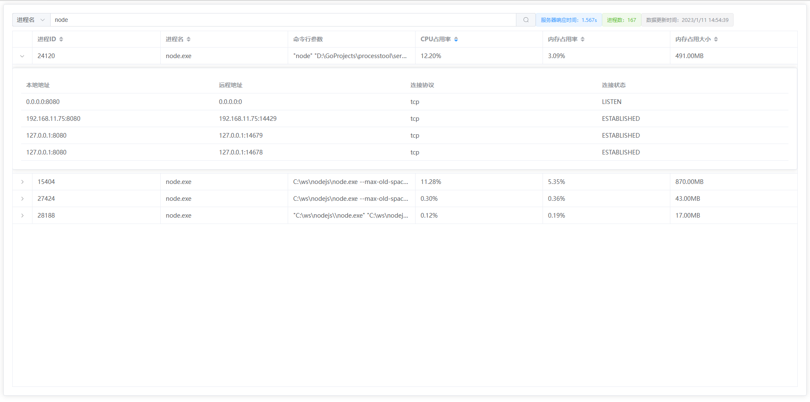
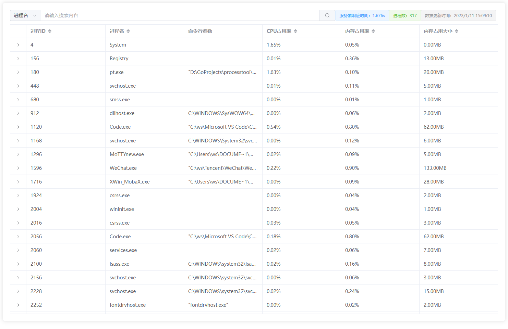

# processtool

进程管理工具

# 现有功能

- [x] 查看当前所有进程 ID/进程名/命令行参数/当前 CPU、内存占用率/内存占用大小
- [x] 查看进程对应的网络连接情况
- [x] 根据进程 ID 或进程名查找进程
- [ ] 根据指定条件筛选进程列表
- [ ] 进程管理：开始/暂停/停止
- [ ] 进程守护

# 使用

```shell
  -ap int
        api server port (default 9091)
  -debug
        debug mode, show more info
  -ui
        show web ui (default true)
  -up int
        ui server port (default 9090)
```

# 效果图



